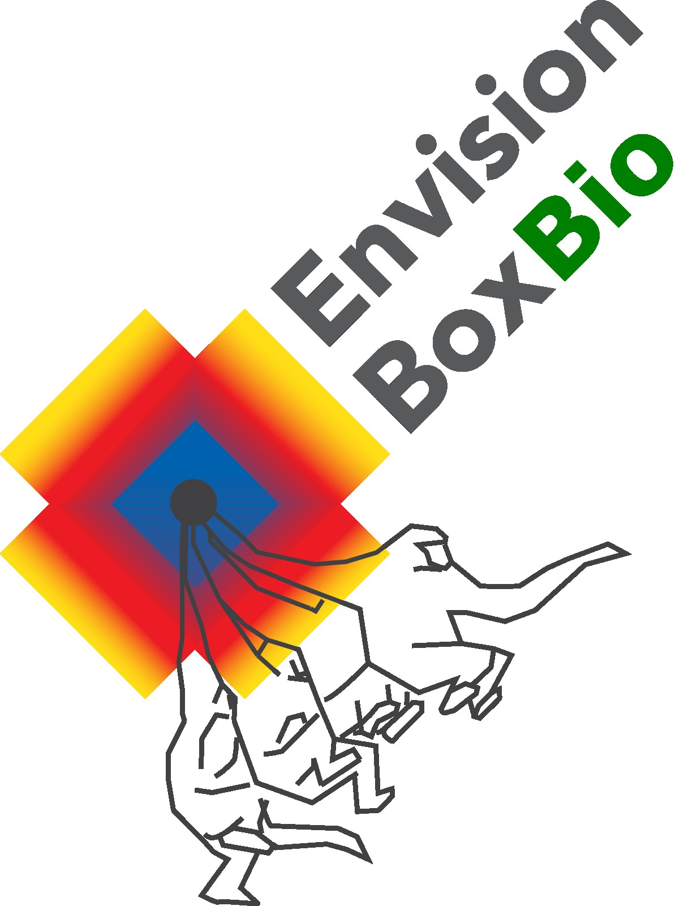
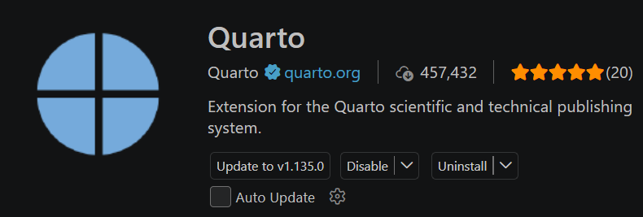
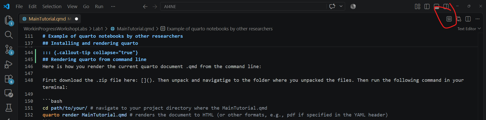

<!-- this is what a comment looks like in quarto, it will not be rendered in the final document. -->


```{=html}
<div class="video-widget">
  <div style="position: relative; width: 100%; height: 0; padding-bottom: 56.25%">
    <iframe src="https://tilburguniversity.cloud.panopto.eu/Panopto/Pages/Embed.aspx?id=a2e5fef9-12f2-4f2e-8280-b4ad009dff94&autoplay=false&offerviewer=true&showtitle=true&showbrand=true&captions=false&interactivity=all" style="border: 1px solid #464646; position: absolute; top: 0; left: 0; width: 100%; height: 100%; box-sizing: border-box;" allowfullscreen allow="autoplay" title="Tutorial video"></iframe>
  </div>
</div>
```

<!-- This chunck loads in the logos, and scales, them. It uses html -->
<div style="display: flex; justify-content: center; align-items: center; gap: 20px;">
  
  
  
</div>

# Info
As a computational scientist or student you are often asked to write technical reports to be communicated in a way that colleagues who are not always expert on the methods can easily start to discover what research you have performed. What often happens is that a report is written in Word, Google Docs or overleaf, and then the detailed code that was used to generate the results is added as an appendix. This is far from ideal as you are creating a split attention of information. What if we can write a document that contains the code, the results, and the discussion in one place, but presented in a way that readers can choose what affords further scrutiny. And what if we can do this in a way that the code can be run and the results reproduced by anyone who has access to the document? In principle Quarto allows you to write fully integrated reproducible computational notebooks, or even fully integrated manuscripts/theses with code embeddings.

## So what is this document?
The documents that are pointed to here act as templates for starting to write computational reports. It goes from this introduction Quarto notebook to basic and more advanced notebooks. The current notebook is 0. Introduction, which can be downloaded and re-rendered by unpacking this zip: [download zip package](https://wimpouw.github.io/AI4NE/docs/assets/intronotebook.zip){download=""}.

For an overview of the templates here as a starting point:

::: {.panel-tabset}
### 0. Introduction

Inspect notebook: [https://wimpouw.github.io/AI4NE/](https://wimpouw.github.io/AI4NE/).

Execute yourself: Download the zip [here](docs/assets/intronotebook.zip){download=""}. 


**Content**

- Introduces basic Quarto features and installation
- Introduces how to host your notebook on a website
- Shows how to run code chunks, and how to show code chunks without running them
- Explains the video integration feature

**Notebook features**

- Video integration

### 1. Basic notebook


Inspect notebook: [https://wimpouw.github.io/AI4NE/basicnotebook.html](https://wimpouw.github.io/AI4NE/basicnotebook.html).

Execute yourself: Download the zip [here](docs/assets/basicnotebookprerendered.zip){download=""}. 


**Content**

- Just a basic Quarto notebook with some code chunks, but no extra features


### 2. Basic notebook with references

Inspect notebook: [https://wimpouw.github.io/AI4NE/basicnotebookwithcitations.html](https://wimpouw.github.io/AI4NE/basicnotebookwithcitations.html).

Execute yourself: Download the zip [here](docs/assets/basicnotebookwithcitations.zip){download=""}. 

**Content**

- How to add references and citations in Quarto, and how to make a bibliography

**Notebook features**

- Citations from a `.bib` library

:::

::: {.callout-tip collapse="true"}
# Example of Quarto notebooks by other researchers

Perhaps for inspiration you would also like to see some examples of how Quarto can be used in cognitive science and AI:

- Computational Pipeline in `Python` + `R` Behavioral Science by Šárka Kadavá [https://sarkadava.github.io/FLESH_Effort/](https://sarkadava.github.io/FLESH_Effort/)
- Teaching materials in `Python` for environmental datasets by Carmen Galaz García and Annie Adams [https://meds-eds-220.github.io/MEDS-eds-220-course/](https://meds-eds-220.github.io/MEDS-eds-220-course/)
- Manuscript completely written in Quarto, peer-reviewed and interactive by Park and colleagues, 2023 [https://www.journalovi.org/2023-park-gatherplots/](https://www.journalovi.org/2023-park-gatherplots/)
- Executable computational books, the neighbouring Jupyter Book ecosystem [https://executablebooks.org/en/latest/gallery/](https://executablebooks.org/en/latest/gallery/)
:::

## So why Quarto over Jupyter notebook or RMarkdown?
Well, Jupyter notebook is a great tool for interactive coding and data exploration, but it is not ideal for creating polished reports. Quarto allows you to create documents that are both interactive and professional-looking with a lot of flexibility to add dynamic elements like slides, charts, quizes, tutorial videos (like here), even live executable Python code, and it can support multiple programming languages, including R, Python (so for those who like plotting in R but data wrangling and ML in Python, this is your home!). Rmarkdown also allows for building similar type computational notebooks ([example](https://wimpouw.github.io/kineticsvoice/)), but the integration with Python is not as smooth as in Quarto and does not have an as advanced layout engine.

## Installation, setup, command line rendering
Quarto is a command line tool that can be installed on your computer. Here we assume you have installed Anaconda and Python for running Python code chunks. 

::: {.callout-tip collapse="true"}

## Installation anaconda, Python, Visual Studio Code

Install anaconda [quick guide here](https://researchguides.uoregon.edu/library_workshops/install_anaconda).

Install Visual Studio Code from [here](https://code.visualstudio.com/download). Don't use Jupyter notebook as your IDE as this will give issues when you try to run the Solara dashboards that Python mesa makes use of.
:::

::: {.callout-tip collapse="true"}
## Installing Quarto
To install Quarto, follow the instructions on the [Quarto website](https://quarto.org/docs/get-started/). After installation, you can verify that Quarto is installed correctly by running the following command in your terminal:

```bash
quarto check install
```
:::

::: {.callout-tip collapse="true"}
## Rendering Quarto from command line
Here is how you render the current Quarto document .qmd from the command line:

First download the .zip file here: [](). Then unpack and navigate to the folder where you unpacked the files. Then run the following command in your terminal:

```bash
cd path/to/your/ # navigate to your project directory where the MainTutorial.qmd
quarto render MainTutorial.qmd # renders the document to HTML (or other formats, e.g., pdf if specified in the YAML header)
```
:::

::: {.callout-tip collapse="true"}
## Rendering Quarto in your IDE (Visual Studio Code)
You can render the Quarto in the terminal of Visual Studio Code. However, you can also install the plugin for Quarto in Visual Studio Code. 

Go to extensions (Ctrl+Shift+X or Cmd+Shift+X) and search for "Quarto". Install the Quarto extension by Quarto Project. Here is a screenshot of what it looks like:



And when that is correctly installed (maybe you need to restart Visual Studio Code), you will see a "Render" button, which looks like this:



After installation, you can render the document by clicking on the "Render" button in the top right corner of the editor window. You can also use the command palette (Ctrl+Shift+P or Cmd+Shift+P) and search for "Quarto: Render Document".

This tutorial from E. Eli Holmes is also helpful for rendering a Quarto document from Visual Studio Code: [https://www.youtube.com/watch?v=IJe3A8-Ee2E](https://www.youtube.com/watch?v=IJe3A8-Ee2E)

:::

## What Python is running? And how to use environments.

In the YAML header on the top of this document you see that the engine is set to Jupyter and the Jupyter kernel is set to python3. In this case python3 just means "the Python that Jupyter finds", which is normally the conda environment you activated before rendering.

### The current setting

```{.yaml filename="Look up these lines in the YAML header of this document"}
engine: jupyter    # <1>
jupyter: python3   # <2>
```
1. Tells Quarto to run code through a Jupyter kernel rather than through knitr (which would a helpful setting when combined with R).
2. Asks Jupyter for the kernel registered as `python3`, which is whatever Python Jupyter finds first. Activate an environment in the (Visual Studio) code terminal before rendering and that is the one you get. If a kernel you have never heard of shows up during render, something has registered itself as `python3`. If you have clean Anaconda install it will often resolve to base environment. If you want to have control just create an environment as explained below.

::: {.callout-tip collapse="true"}
## Using a specific conda environment

You first register a conda environment, let's say `AI4NE` in your terminal with the following command:

```bash
# create a fresh environment called AI4NE with python 3.10
conda create -n AI4NE python=3.10

# to install packages in that environment, switch into it
conda activate AI4NE

# install the packages you need, ipykernel is what makes it visible to Jupyter
pip install ipykernel matplotlib pandas numpy scikit-learn

# register the environment as a kernel so Quarto can find it by name
python -m ipykernel install --user --name AI4NE
```

Then you can use that environment in your Quarto document by specifying it in the YAML header like this:

```{.yaml filename="YAML header, using a named environment"}
engine: jupyter    # <1>
jupyter: AI4NE     # <2>
```
1. Same as above, run through a Jupyter kernel.
2. Now the document names the environment it needs. If that kernel is not registered, the render fails with a clear message instead of silently falling back to another Python.

:::: {.callout-warning collapse="true"}
## Troubleshooting

Conda environment not detected? Most problems come from your python interpreter of visual studio code pointing to the wrong python. If you have multiple python installations, this is a common source of errors. Here is to properly connect visual studio code to your anaconda python installation:

1. In Visual Studio Code, press `Ctrl + Shift + P`
2. Type "Python: Select Interpreter"
3. Select the python interpreter that is part of your anaconda installation (e.g., `C:\Users\yourusername\anaconda3\python.exe`)
4. Restart visual studio code and try again

::::
:::

Note that you can make the Quarto document be a computationally reproducible report where everything is computed on the fly, or you can make it a static report where the code is merely shown but not executed, or it is based on pre-computed results. See below for how to run a code chunk or show a code chunk without evaluating it. 

## Let's run some Python in this notebook
```{python, code-fold: false}
#| code-fold: false
 
# This is a code chunk that will be executed when the document is rendered.
meaning_of_life = 42
print("The meaning of life is: " + str(meaning_of_life))
```


# Hosting your notebook on a server as website pages
When you render your Quarto notebook, you generate a .html (next to other possible formats, like pdf). These can then serve as website pages on a server, available to anyone who has the link. In this way you have a nice portable link, no need to send over files. You can host your own (computational) web pages via Github or Codeberg.  

Github is a for-profit industry standard, but codeberg is a German non-profit that ensures privacy and consistently free services. Github might one day decide to start charging for hosting, and will surely be selling your data, writings and code. Since codeberg requires a bit more effort to set up, we will focus here on github, but provide a codeberg runthrough as well.

## How to Github pages
0. Create a free account on [https://github.com/](https://github.com/signup?ref_cta=Sign+up&ref_loc=header+logged+out&ref_page=%2F&source=header-home) (remember the username and password you set). You will need this to host your pages on github.

1. Install github desktop from [https://desktop.github.com/](https://desktop.github.com/). This will install git and a nice GUI for managing your repositories. 

::: {.callout-tip collapse="true"}
If you want a quick runthrough of how to use github desktop, see this tutorial by Coder Coder [https://www.youtube.com/watch?v=8Dd7KRpKeaE](https://www.youtube.com/watch?v=8Dd7KRpKeaE). Note if you are already comfortable with git you can of course use command line git.
:::

2. Open **GitHub Desktop** > enter your credentials once > File > Add Local Repository > pick your project folder that **has a docs folder** with an index.html (and any associated images, or assets folder, for more complex notebooks). You can for example copy the materials for this very basic notebook [download here]. If it says the folder is not a git repository, click **create a repository here** and it will create an empty folder where you can copy your docs folder to. Make sure your repo is set to **public**, otherwise github pages will not work on a free account.

3. After having rendered your Quarto document as index.html, copy the index.html and any associated files if present (e.g., images, assets) to the `docs` folder in your local repository. You can download the basic notebook materials [here](docs/assets/basicnotebookprerendered.zip){download=""} and copy the contents to the `docs` folder of your local repository which you then push to github (see 5).

5. Now you can commit your changes to the local repository, and then push them to github.com. Click **Commit to main** and then **Push origin**. You may be asked for your github credentials, and then it will push the files to your github account.

6. On github.com, go to your repo > **Settings** > **Pages**. Under *Source*, choose **Deploy from a branch**, set branch to `main` and folder to `/docs`. Save. Docs is where you html pages are, and it will automatically search for an index.html file to serve as the main page. 

7. Wait a minute or two, then visit `https://YOURNAME.github.io/REPONAME/`. Or refresh the site with Ctrl+Shift+R.

That's it. You have now created your own website. Indeed, you can also build your own website as a live CV via this method (it does not need to be a computational notebook). You can imagine in your future career this is a great way to showcase your work (e.g., as a link in your CV or scientific article), and to make your research more accessible to the public. Or you may host your computational notebooks at a private server at your organization or company, which will be used by your colleagues internally when discussing the data and analyses you have performed.

::: {.callout-warning}
Do note that everything you put online is public. You should therefore never commit participant data, API keys, or datasets you are not allowed to share. Also note that large files >100MB will not be uploaded to github, so if you have large datasets, you will need to host them elsewhere and link to them.

You can always send your materials as a zip file to colleagues or your teacher for local evaluation, so you don't have to work online/publicly.
:::

::: {.callout-tip collapse="true"}
## How to Codeberg pages
[TO DO]
:::


# Special features of this notebook
:::: {.callout-tip collapse="true"}
## Video integration, how does that work?

You can embed video in a Quarto document with plain HTML, using an `iframe` pointing at YouTube, Vimeo, or a public Panopto. This notebook goes a step further: the video is a widget that scrolls along with the page, so it stays visible while you read.

Three files in the `assets` folder do the work:

| File | What it does |
|------|--------------|
| `sticky-video.css` | Positioning and styling of the floating player |
| `sticky-video.js` | Scroll behaviour |
| `sticky-video.html` | The container fragment |

**Step 1.** Add the stylesheet to your YAML header:

```yaml
format:
  html:
    toc: true
    toc-location: left
    toc-title: "Contents"
    toc-depth: 3
    number-sections: true
    code-fold: true
    code-tools: true
    theme: cosmo
    css: 
      - assets/styles.css        # <1>
      - assets/sticky-video.css  # <2>
```
1. General page styling. Optional, this is just how the notebook looks.
2. **This is the one that matters here.** It makes the video float and follow the scroll.

**Step 2.** Put this chunk at the top of your document, replacing the `src` with your own video link:

```{{=html}}
<div class="video-widget">
  <div style="position: relative; width: 100%; height: 0; padding-bottom: 56.25%">
    <iframe 
      src="https://tilburguniversity.cloud.panopto.eu/Panopto/Pages/Embed.aspx?id=YOUR-VIDEO-ID&autoplay=false&offerviewer=true&showtitle=true&showbrand=true&captions=false&interactivity=all" 
      style="border: 1px solid #464646; position: absolute; top: 0; left: 0; width: 100%; height: 100%; box-sizing: border-box;" 
      allowfullscreen 
      allow="autoplay" 
      title="Tutorial video">
    </iframe>
  </div>
</div>
```

::: {.callout-note appearance="simple"}
The `padding-bottom: 56.25%` keeps the player at a 16:9 aspect ratio at any width. Change it only if your source video has different proportions.
:::
::::

::: {.callout-note}
## Feedback & Contributions
Let's make this a community effort! If you have suggestions, or you want to add things. Please propose something and join the team!
:::
